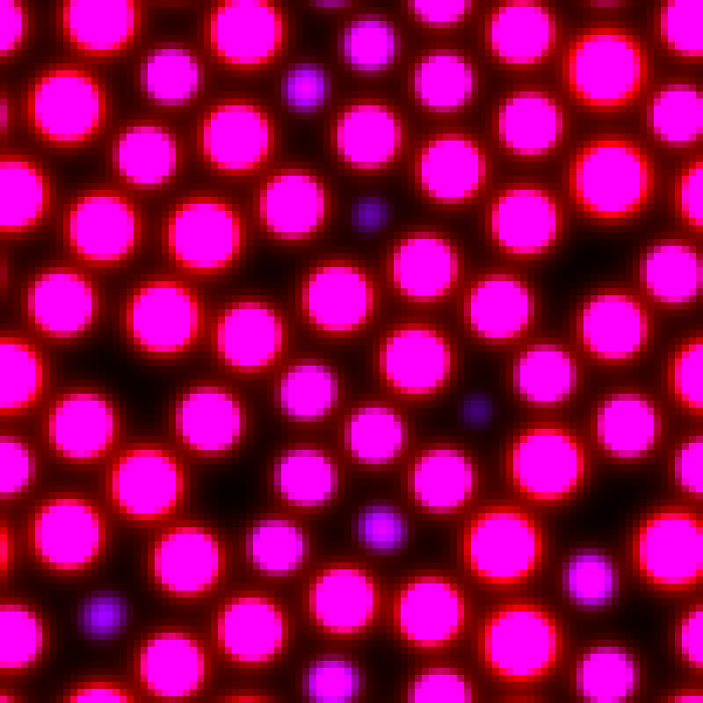
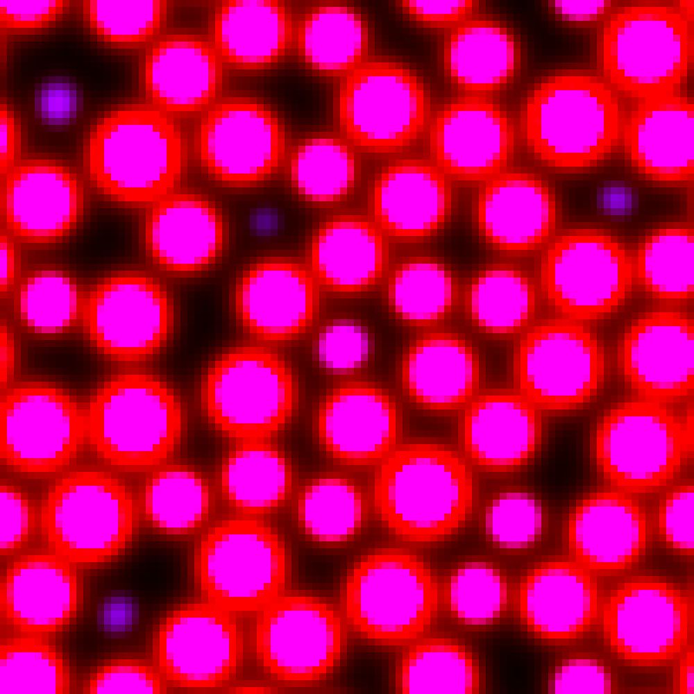
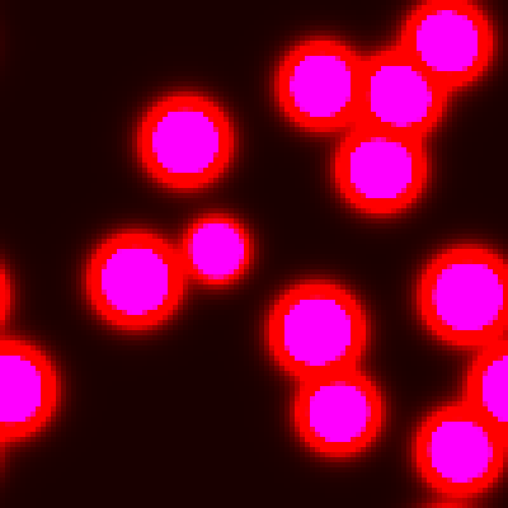
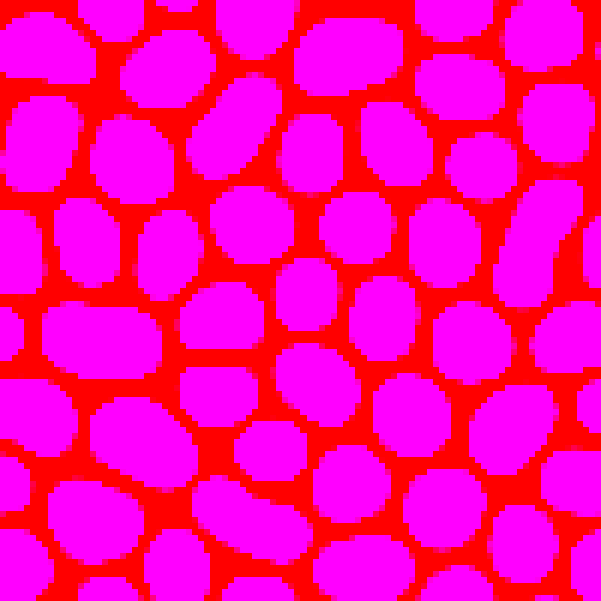

# Turing Patterns Simulation

[Turing patterns](https://en.wikipedia.org/wiki/Turing_pattern) simulation
implemented in Fennel and Love.

Some patterns generated with the simulation:

| Pattern | Pattern |
|---------|---------|
|  |  |
|  |  |
|  |  |
|  | |

## Setup

Requires Lua, LuaRocks, Fennel and [fnx](https://github.com/gbaptista/fnx).

Run the following command to install dependencies:

```bash
fnx dep install --verbose
```

Run the following command to run tests:

```bash
fnx tests.fnl
```
